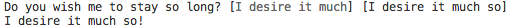

# reloquent

[](https://www.npmjs.com/package/reloquent)
[](https://ci.appveyor.com/project/4r7d3c0/reloquent)

_Reloquent_ allows to ask users a question, a confirmation (y/n), or a series of questions via the read-line interface. 

```sh
yarn add reloquent
npm i reloquent
```

## Table Of Contents

- [Table Of Contents](#table-of-contents)
- [API](#api)
- [`Question` Type](#question-type)
  * [<strong><code>text*</code></strong>](#text)
  * [<code>validation</code>](#validation)
  * [<code>postProcess</code>](#postprocess)
  * [<code>defaultValue</code>](#defaultvalue)
  * [<code>getDefault</code>](#getdefault)
  * [<code>password</code>](#password)
  * [<code>Question</code>](#type-question)
- [`async askSingle(question: (string|!Question), timeout=: number): string`](#async-asksinglequestion-stringquestiontimeout-number-string)
- [`async askQuestions(questions: !Questions, timeout=: number): !Object<string, string>`](#async-askquestionsquestions-questionstimeout-number-objectstring-string)
  * [`Questions`](#type-questions)
- [`async confirm(question: (string|!Question), options=: !ConfirmOptions): boolean`](#async-confirmquestion-stringquestionoptions-confirmoptions-boolean)
  * [`ConfirmOptions`](#type-confirmoptions)
- [Copyright](#copyright)

<p align="center"><a href="#table-of-contents">
  
</a></p>


## API

There are 4 types of calls to the API:

- ask a single question as a string;
- ask a single question as an object;
- ask multiple questions.
- ask for a confirmation;

Their respective methods can be accessed via the `import` statement:

```js
import ask, { askSingle, confirm } from 'reloquent'
```

<p align="center"><a href="#table-of-contents">
  
</a></p>

## `Question` Type

When asking a question which is not a string, the `question` object should have the following structure:

<table>
 <thead>
  <tr>
   <th>Property</th>
   <th>Type</th>
   <th>Description</th>
   <th>Example</th>
  </tr>
 </thead>
 <tbody>
  <tr>
   <td><a name="text"><strong><code>text*</code></strong></a></td>
   <td><em>string</em></td>
   <td>Display text. Required.</td>
   <td>

```js
const q = {
  text: 'What is your name',
}
```
  </td>
  </tr>
  <tr>
   <td><a name="validation"><code>validation</code></a></td>
   <td><em>(async) function</em></td>
   <td>A function which needs to throw an error if validation does not pass.</td>
   <td>

```js
const q = {
  text: 'What is your name',
  validate(v) {
    if (!v.length) {
      throw new Error('Name required.')
    }
  },
}
```
  </td>
  </tr>
  <tr>
   <td><a name="postprocess"><code>postProcess</code></a></td>
   <td><em>(async) function</em></td>
   <td>A function to transform the answer.</td>
   <td>

```js
const q = {
  text: 'What is your name',
  postProcess(v) {
    return `${v.toLowerCase()}`
  },
}
```
  </td>
  </tr>
  <tr>
   <td><a name="defaultvalue"><code>defaultValue</code></a></td>
   <td><em>string</em></td>
   <td>

Default answer (shown to users in `[default]` brackets).</td>
   <td>

```js
const q = {
  text: 'What is your name',
  defaultValue: 'Visitor',
}
```
  </td>
  </tr>
  <tr>
   <td><a name="getdefault"><code>getDefault</code></a></td>
   <td><em>(async) function</em></td>
   <td>A function to execute to obtain the default value.</td>
   <td>

```js
const q = {
  text: 'What is your name',
  async getDefault() {
    await git('config', 'user.name')
  },
}
```
  </td>
  </tr>
  <tr>
   <td><a name="password"><code>password</code></a></td>
   <td><em>boolean</em></td>
   <td>Hide the inputs behind <code>*</code> when typing the answer.</td>
   <td>

```js
const q = {
  text: 'Please enter the password',
  password: true,
}
```
  </td>
  </tr>
 </tbody>
</table>


If both `defaultValue` and `getDefault` are provided, the result of the `getDefault` takes precedence:

```js
const q = {
  defaultValue: 'I desire it much',
  getDefault() {
    return 'I desire it much so'
  },
}
```



When the `password` property is set to true, the answer will be hidden behind the `*` symbols.

```js
import { askSingle  } from 'reloquent'

const Password = async () => {
  const res = await askSingle({
    text: 'Please enter the password',
    password: true,
  })
  return res
}
```
```
Please enter the password: ********
```

<details>
 <summary><strong><a name="type-question"><code>Question</code></a> extends <a href="#type-readlinereadlineoptions"><code>readline.ReadLineOptions</code></a></strong>: A question.</summary>

|     Name     |                              Type                               |                               Description                               | Default |
| ------------ | --------------------------------------------------------------- | ----------------------------------------------------------------------- | ------- |
| __text*__    | <em>string</em>                                                 | The text to show to the user.                                           | -       |
| defaultValue | <em>string</em>                                                 | The default answer to the question.                                     | -       |
| password     | <em>boolean</em>                                                | Hide the inputs behind `*` when typing the answer.                      | `false` |
| getDefault   | <em>() => (string \| !Promise&lt;string&gt;)</em>               | The function which will get the default value, possibly asynchronously. | -       |
| validation   | <em>(answer: string) => void</em>                               | The validation function which should throw on error.                    | -       |
| postProcess  | <em>(answer: string) => (string \| !Promise&lt;string&gt;)</em> | The transformation function for the answer.                             | -       |
</details>

<p align="center"><a href="#table-of-contents">
  
</a></p>

## <code>async <ins>askSingle</ins>(</code><sub><br/>&nbsp;&nbsp;`question: (string|!Question),`<br/>&nbsp;&nbsp;`timeout=: number,`<br/></sub><code>): <i>string</i></code>
Ask user a question via the CLI. Returns the answer to the question. 
    If a timeout is passed, the promise will expire after the specified 
    number of milliseconds if the answer was not given.

 - <kbd><strong>question*</strong></kbd> <em><code>(string \| <a href="#type-question" title="A question.">!Question</a>)</code></em>: The question to present to the user.
 - <kbd>timeout</kbd> <em>`number`</em> (optional): How long to wait before rejecting the promise. Waits forever by default.

Questions can be asked as a simple string.

```js
import { askSingle } from 'reloquent'

(async () => {
  try {
    const answer = await askSingle('What brought you her', 10000)
    console.log(`You've answered: ${answer}`)
  } catch (err) {
    console.log()
    console.log(err)
    console.log('Nevermind...')
  }
})()
```

```fs
What brought you her: I guess Art is the cause.
```

```fs
You've answered: I guess Art is the cause.
```

Alternatively, _Reloquent_ can ask a question which is passed as an object of the <a href="#type-question" title="A question.">`Question`</a> type, and return a string.

```js
import { askSingle } from 'reloquent'

(async () => {
  const answer = await askSingle({
    text: 'Do you wish me to stay so long?',
    validation(a) {
      if (a.length < 5) {
        throw new Error('The answer is too short')
      }
    },
    defaultValue: 'I desire it much',
    postProcess(a) {
      return `${a}!`
    },
    async getDefault() {
      return 'I desire it much so'
    },
  })
  console.log(answer)
})()
```

```fs
Do you wish me to stay so long? [I desire it much]
```

```fs
I desire it much!
```

<p align="center"><a href="#table-of-contents">
  
</a></p>

## <code>async <ins>askQuestions</ins>(</code><sub><br/>&nbsp;&nbsp;`questions: !Questions,`<br/>&nbsp;&nbsp;`timeout=: number,`<br/></sub><code>): <i>!Object<string, string></i></code>
Ask user a series of questions via CLI and transform them into answers.
    Returns an object with keys as questions' texts and values as answers.

 - <kbd><strong>questions*</strong></kbd> <em><code><a href="#type-questions" title="A set of questions.">!Questions</a></code></em>: A set of questions.
 - <kbd>timeout</kbd> <em>`number`</em> (optional): How long to wait before rejecting the promise. Waits forever by default.

<code>!Object&lt;string, (string \| <a href="#type-question" title="A question.">!Question</a>)&gt;</code> __<a name="type-questions">`Questions`</a>__: A set of questions.

```js
import ask from 'reloquent'

const Ask = async () => {
  const questions = {
    title: {
      text: 'Title',
      validation(a) {
        if (!a) throw new Error('Please enter the title.')
      },
    },
    description: {
      text: 'Description',
      postProcess: s => s.trim(),
      defaultValue: 'A test default value',
    },
    date: {
      text: 'Date',
      async getDefault() {
        await new Promise(r => setTimeout(r, 200))
        return new Date().toLocaleString()
      },
    },
  }
  const res = await ask(questions)
  return res
}
```

If when provided with the following answers (leaving _Date_ as it is), the result will be returned as an object:

```
Title: hello
Description: [A test default value] world
Date: [2/22/2020, 21:37:04] 

Result: {
  "title": "hello",
  "description": "world",
  "date": "2/22/2020, 21:37:04"
}
```

<p align="center"><a href="#table-of-contents">
  
</a></p>

## <code>async <ins>confirm</ins>(</code><sub><br/>&nbsp;&nbsp;`question: (string|!Question),`<br/>&nbsp;&nbsp;`options=: !ConfirmOptions,`<br/></sub><code>): <i>boolean</i></code>
Ask a yes/no question. Returns `true` when answer was `y` and `false` otherwise.

 - <kbd><strong>question*</strong></kbd> <em><code>(string \| <a href="#type-question" title="A question.">!Question</a>)</code></em>: The question, such as "Add default options", or "Continue to delete?".
      The question mark can added automatically.
 - <kbd>options</kbd> <em><code><a href="#type-confirmoptions" title="Options for the confirmation question.">!ConfirmOptions</a></code></em> (optional): Options for the confirmation question.

__<a name="type-confirmoptions">`ConfirmOptions`</a>__: Options for the confirmation question.


|    Name    |       Type       |                               Description                                | Default |
| ---------- | ---------------- | ------------------------------------------------------------------------ | ------- |
| defaultYes | <em>boolean</em> | Whether the default value is _yes_.                                      | `true`  |
| timeout    | <em>number</em>  | How long to wait before rejecting the promise. Waits forever by default. | -       |

```js
import { confirm } from 'reloquent'

const Confirm = async (question) => {
  const res = await confirm(question, {
    defaultYes: false,
  })
  return res
}
```

```
Do you wish to continue (y/n): [n] y

Result: true
```

<p align="center"><a href="#table-of-contents">
  
</a></p>


## Copyright

<table>
  <tr>
    <th>
      <a href="https://www.artd.eco">
        
      </a>
    </th>
    <th>© <a href="https://www.artd.eco">Art Deco™</a>   2020</th>
  </tr>
</table>

<p align="center"><a href="#table-of-contents">
  
</a></p>